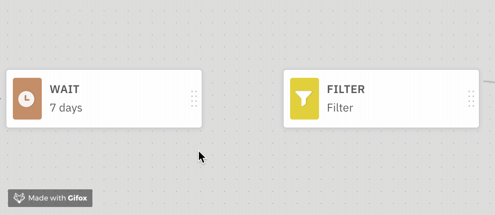
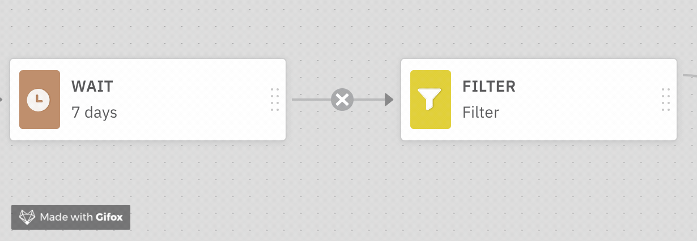
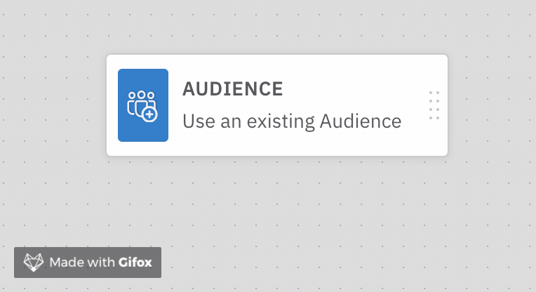

# Campaign Controls

### Connecting Blocks

To connect two Blocks, click and drag from one Edge connector to the next. 

### Deleting a Connection

To delete a connection, click on the X for the connection. 

### Deleting a Block

To delete a Block, hover over the block and click on the Trash icon. 

### Launch/Stopping a Campaign

Click on the **Launch** button on the upper right to launch a Campaign. Once launched, the same button will read **Stop**. Click to stop it.

