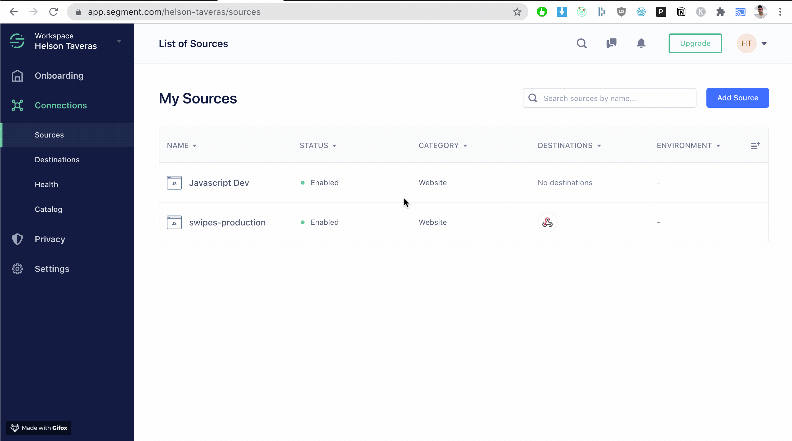
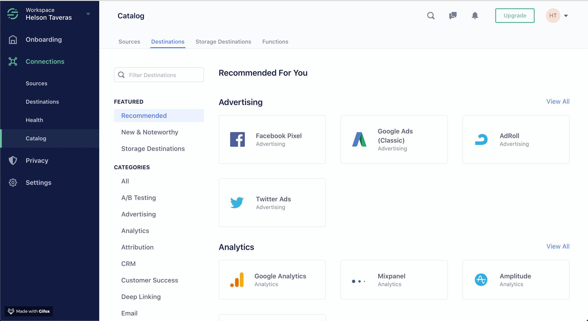

# Importing Data

### Importing Data

There are three ways you can import data into Sequence at the moment:

* Via **Segment Webhook** connector \(read below\)
* Via [**HTTP API**](api-reference/segment/)\*\*\*\*
* Via [**NodeJS SDK**](https://www.npmjs.com/package/sequence-node)\*\*\*\*
* Via CSV \(coming soon\)
* Via Intercom \(coming soon\)

### Segment Connector


Note: these instructions are available via our onboarding flow, accessible [here](https://my.sequence.so/onboarding) \([https://my.sequence.so/onboarding](https://my.sequence.so/onboarding)\). 


In this setup, we'll create a pipeline from your Segment data to Sequence. In Segment, visit **Connections &gt; Source** and select the source you'd like to send data from. 

Then, click **Add Destination.** Select **Custom Webhook \(Raw Data\) &gt; Configure Webhook** and give it a name \(Sequence\). 

The Webhook URL is `https://api.sequence.so/api/segment`. 

Next you'll need your auth token. This is available at `https://my.sequence.so/onboarding/segment`.

Fill in the custom headers field with `Authorization: {Token}`.

Lastly, make sure the webhook is turned on!

Back in the Sequence dashboard, click "Next" at the bottom of the Segment integration page. You'll see this page:

Once Segment sends over data, you'll see this:

### API Import

You can also import data via our HTTP API. 



